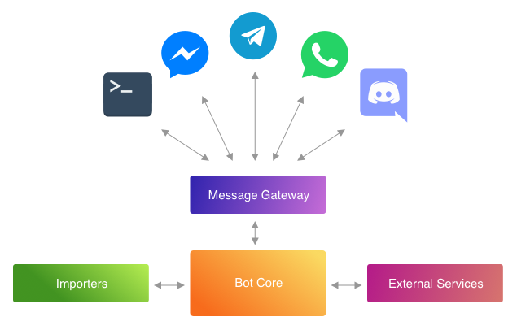

# Proyecto 2021 - Segundo Semestre - Segunda Entrega
### FIT - Universidad Católica del Uruguay

 

En esta segunda instancia nos enfocaremos en la lógica interna del bot —en el _core_. — Para esto dejaremos por un momento de lado las integraciones con las plataformas de chat.

El siguiente diagrama ilustra lo que denominamos _core_, y los elementos que no son parte de él.

Los siguientes elementos **_no_** son parte del _core_:

- **_Message Gateway_**: componentes relacionados a manejar la entrada y salida de mensajes con los usuarios

- **_Importers_**: componentes relacionados a manejar la importación de datos (desde archivos por ejemplo)

- **_External Services_**: componenetes que representan servicios externos no conversacionales como APIs de Google, etc.

El objetivo de esta entrega será hacer funcionar el _core_ del bot y probar que cumple con la especificación (casos de test).

## Entregables

- **Proyecto de C#** que incluye:

    - código de la solución (`src/Library/`)

    - casos de test (en uno o mas proyectos de test dentro del directorio `src/Test/`)

    - documentación (generada con [Doxygen](https://www.doxygen.nl/index.html))

**_Aclaración_**: No es necesario entregar un archivo `Program.cs` con código funcional. El funcionamiento del bot debe quedar evidenciado mediante el proyecto de test. 

**_Recuerda_**: Haremos especial incapié en las justificaciones de principios y patrones utilizados.

**_Recuerda_**: Existe un catálogo de patrones de diseño que es parte de la bibliografía del curso. Si no puedes acceder al libro, existen recursos online como [refactoring.guru/design-patterns](https://refactoring.guru/design-patterns). Es importante que conozcas los patrones del catálogo y los utilices en tu solución.

## Fecha de entrega

Véase [Tabla de Entregas](../README.md#entregas). 

## Medio de entrega

Se entregará en una [tarea de WebAsignatura](https://webasignatura.ucu.edu.uy/course/view.php?id=288&section=1) un link al repositorio del equipo conteniendo todos los artefactos entregables. Si no se entrega link a un commit específico de la rama _master_, el equipo docente evaluará el último commit en _master_ previo a la fecha de entrega.

Un integrante por equipo deberá completar la entrega.

**No se admitirán entregas fuera de fecha.**

**Sólo se admitirán entregas por WebAsignatura en la tarea provista con link a GitHub y en la rama master1.**

Todos los entregables que sean de documentación (diagramas, tarjetas, documentos, etc.) deberán entregarse dentro del directorio `docs/`.

Los proyectos de código fuente deberán crearse dentro del directorio `src` (como es habitual).

Deberá existir ademas un archivo README.md en la raiz del repositorio para incluír las notas del equipo. Véase [Notas](#notas).

## Notas

Alentamos al equipo a que utilice el archivo de README en su repositorio para incluír notas de reflexión durante el desarrollo del proyecto. Estas notas pueden incluír:

- Qué desafíos de la entrega fueron los más difíciles

- Qué cosas aprendieron enfrentándose al proyecto que no aprendieron en clase como parte de la currícula

- Qué recursos (páginas web, libros, foros, etc) encontraron que les fueron valiosos para sortear los desafíos que encontraron

- Y cualquier otro tipo de reflexión, material o comentarios sobre el trabajo en el proyecto.

****

1 _En caso de que WebAsignatura o GitHub no se encuentren en línea para realizar la entrega antes de finalizado el plazo de entrega se aceptará como excepción entrega por correo electrónico del repositorio completo en formato zip_.

